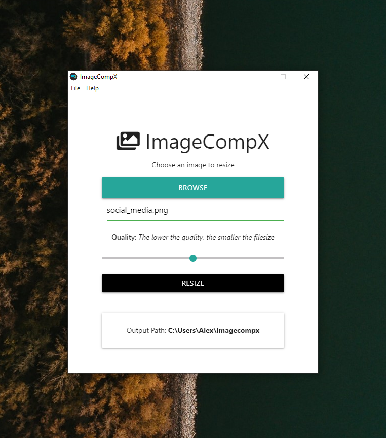

# image-compx
Electron desktop app to compresss/resize images

### Rationale for building the app:

Exploring Electron and build a useful tool

### List of App's Functionality:

- Communication between main process, renderer and viceversa
- Cross-platform
- Using plugins

### Instructions for Deploying the App Locally:

- Clone or download the repo
- Open in a text editor the folder
- npm install
- npm run package-mac or npm run package-win or npm run package-linux
